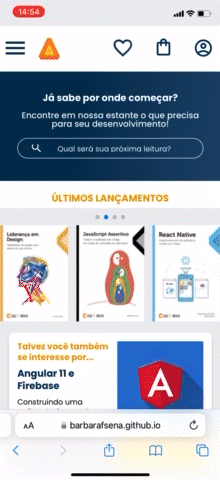

<h1>Resumo do Projeto</h1>

 Tela inicial do site da AluraBook desenvolvido durante o curso "HTML e CSS: Responsividade com mobile-first" da plataforma Alura. 

## 📱 Visualização em smartphones

## 🖥️ Visualização em desktops

## ✔️ Tecnologias utilizadas

- ``CSS``
- ``HTML``
- ``JavaScript``

## 📁 Acesso ao projeto
📁 Você pode acessar os arquivos do projeto clicando [aqui](https://github.com/barbarafsena/alura-books.git)   
💻 📱 Você pode acessar o site clicando [aqui](https://barbarafsena.github.io/alura-books/)

# Autora
  Bárbara Sena
   
 

